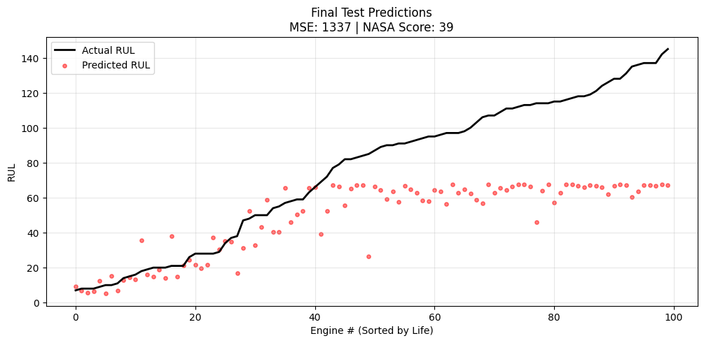

# Predictive Maintenance of Turbofan Engines (RUL Prediction)

## Project Overview
This project implements a Deep Learning workflow to predict the Remaining Useful Life (RUL) of aircraft turbofan engines. By analyzing time-series sensor data, the model predicts how many operational cycles an engine has left before failure.

This approach moves beyond traditional "Threshold-Based Maintenance" (fixing only when broken) to Predictive Maintenance, allowing for optimized scheduling and reduced downtime in aerospace systems.

## The Dataset: NASA CMAPSS 
The project utilizes the C-MAPSS (Commercial Modular Aero-Propulsion System Simulation) dataset provided by NASA.
- Source: NASA Prognostics Data Repository
- Structure: Multivariate Time-Series Data.
- Scenario: Engines run efficiently at the start and degrade over time until failure.
- Input Dimensions:
  - 3 Operational Settings: Altitude, Mach Number, Throttle Resolver Angle.
  - 21 Sensors: Total Temperature, Pressure, Fan Speeds, etc. (across High/Low-Pressure Compressors and Turbines).
 
## Architecture & Methodology
1. Data Preprocessing
    Raw sensor data is noisy and varies in scale. The following engineering steps were applied:
    - Feature Selection: Sensors with constant values (zero variance) across the lifespan were dropped to reduce noise.
    - Normalization: Applied MinMax Scaling to bring all sensor readings between [0, 1] for stable gradient descent.
    - RUL Label Generation: Calculated the inverse linear degradation (RUL = Max Life - Current Cycle). Clipped the RUL at a threshold (125 cycles) because early-stage degradation     is negligible.
    - Sliding Window Segmentation: Converted 2D data into 3D sequences (Samples, Time Steps, Features) to feed into the LSTM.
      - Window Size: 30 Cycles.

  2. The Model: Long Short-Term Memory (LSTM)
    A Recurrent Neural Network (RNN) variant was chosen to capture the temporal dependencies of engine degradation.
      - Layer 1: LSTM (50 units, return_sequences=True) - Captures low-level temporal features
      - Layer 2 : LSTM (100 units) - Abstracts high-level degradation patterns.
      - Dropout: (0.2) - Applied to prevent overfitting.
      - Dense Layer: Output layer with 1 unit (Predicted RUL).
      - Optimizer: Adam.
      - Loss Function: Custom asymmertric loss function to penalise late predicitions more, montiored along with MSE and loss functons suggested by NASA.
    
## Results and Performance : 
  The model was evaluated on the Test set (engines cut off before failure)
   - MSE score : 1336.71
   - NASA's loss function score : 38.64

    
